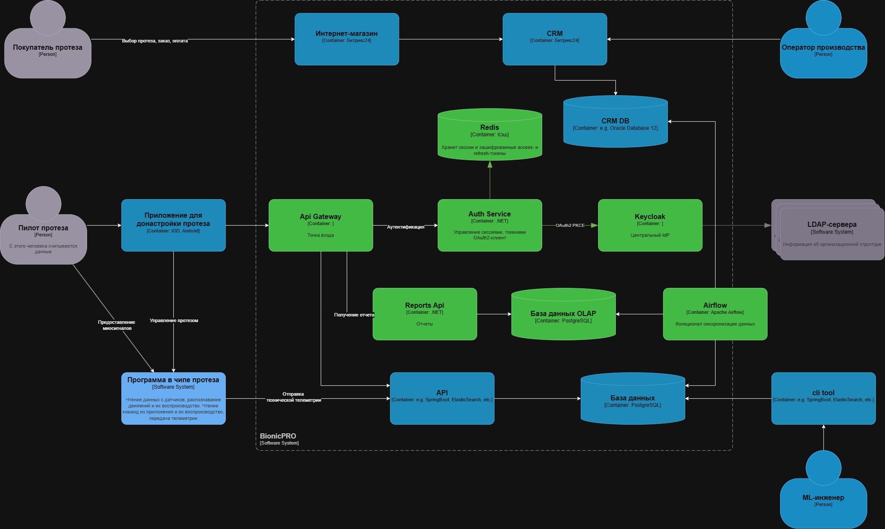
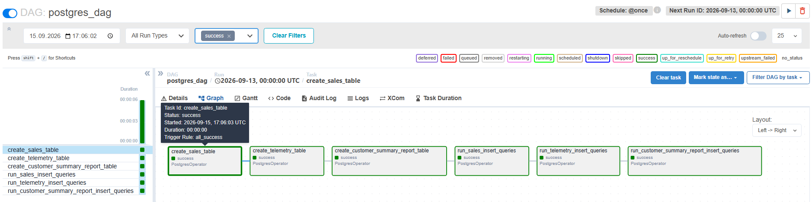
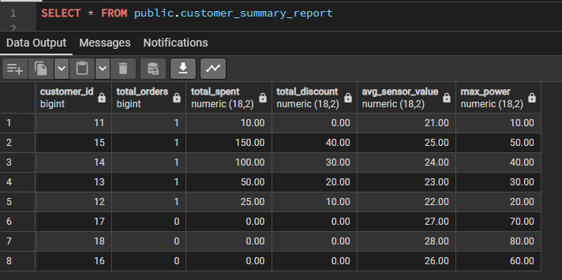
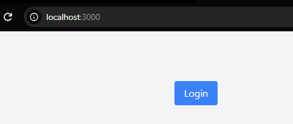
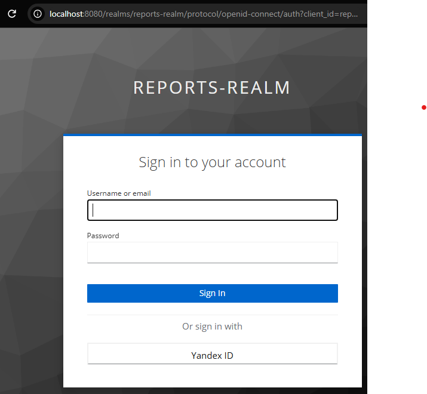
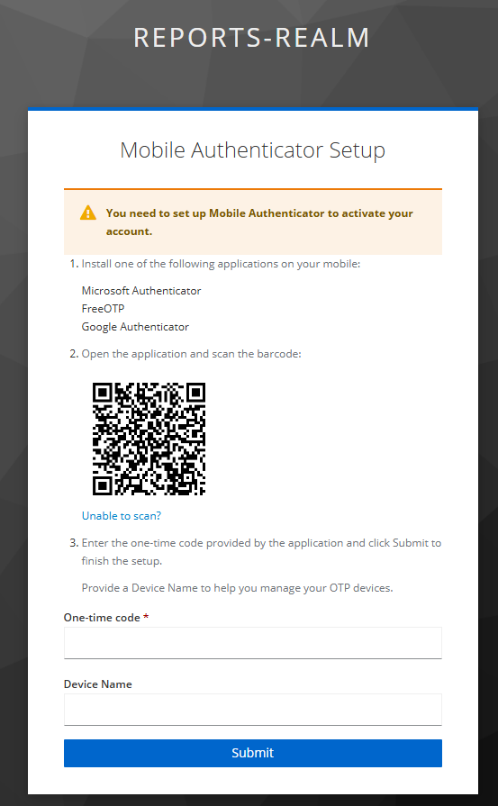
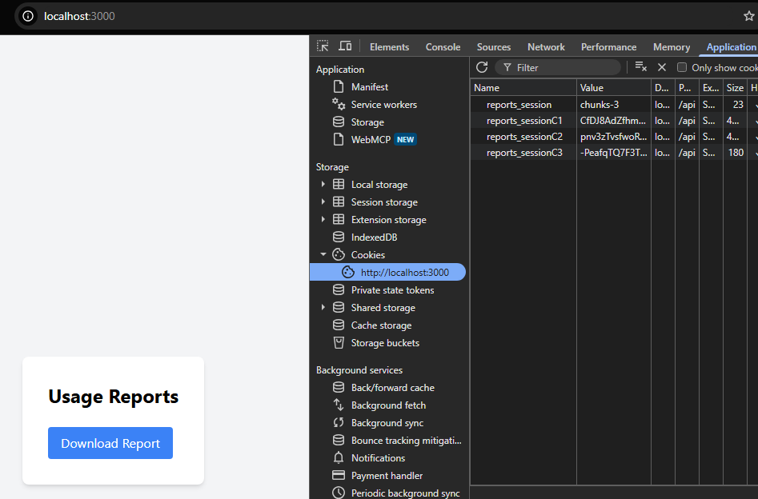
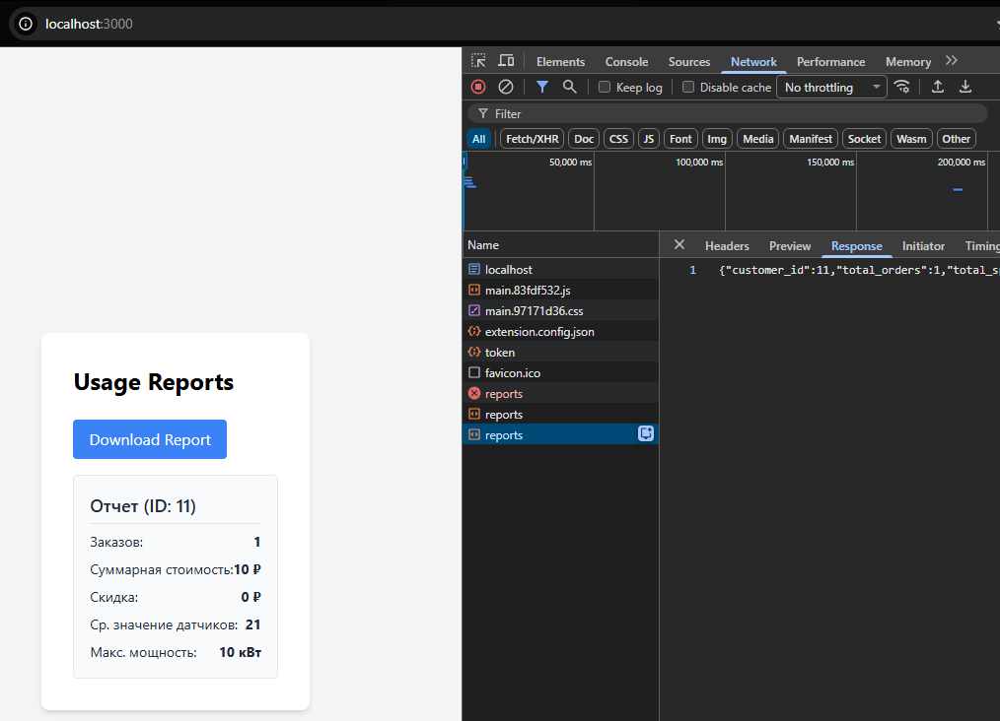

# Задание 1. Повышение безопасности системы

## Задача 1. Предложите архитектурное решение и доработайте диаграмму C4 для управления учётными данными пользователя. 

## Задача 2. Улучшите безопасность существующего приложения, заменив Code Grant на PKCE. 

- в файле `keycloak/realm-export.json` фронтенд клиенту добавлен атрибут **"pkce.code.challenge.method": "S256"**.
- в `frontend/src/App.tsx` добавлено **pkceMethod: "S256"**

## Задача 3. Обеспечьте безопасное получение и хранение access-и refresh-токенов. 
- разработан сервис bionicpro-auth. Исходный код расположен в директории `BionicPro.Auth`. 

## Задача 4. Добавьте LDAP для возможности получения данных о пользователях представительства BionicPRO в другой стране.
- развернут LDAP-сервер OpenLDAP. 

## Задача 5. Настройте MFA.
- настроен механизм OTP-аутентификации + обязательный ввод одноразового пароля.

## Задача 6. Добавьте OAuth 2.0 от Яндекс ID.
- реализована аутентификация пользователей через внешний Identity Provider от Яндекса. 

# Задание 2. Разработка сервиса отчётов

- настроен DAG `postgres_dag` для Apache Airflow. Конфигурация pipeline расположена в директории `airflow`. Web-интерфейс развертывается по адресу `http://localhost:8090` (логин admin, пароль admin).

После выполнения pipeline суммарный отчет по телеметрии и покупкам попадает в БД.

# Процесс получения отчета

1. Заходим по адресу `http://localhost:3000`

2. После нажатия на кнопку `Login` перенаправляем в Keyclock.
Доступна аутентификация по логину+паролю, либо через Yandex ID.

Вводим user1@example.com/password123

3. Из-за включенной MFA производится запрос одноразового кода.

4. Проходим аутентификацию, получаем Cookies с двумя токенами.

5. Получаем отчет

